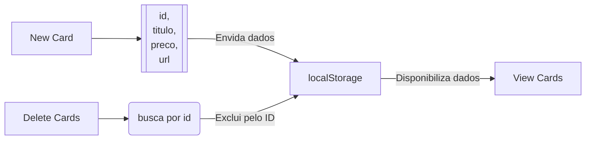

# Projeto Challenge AluraGeek

Olá! Este projeto foi desenvolvido durante o progama de formação Alura One Next T6 em parceria com a Oracle **CardsView**.
O projeto inicial era um site geek para cadastros de produtos com titulo, preço e imagem(url) e incluir também a opção exclusão

# Visualização do projeto

No projeto trabalhei com design responsivo para adaptar a dispositivos móveis, ontem utilizei o flexbox e grid em partes do site para melhorar a experiência. Prints do projeto abaixo:

> ### Visualização WEB
>
> 

### Visualização Mobile

 

 >>

 
## Diagrama do LocalStorage

Lógica criada para o cadastro de novos produtos e exclusão do existente

